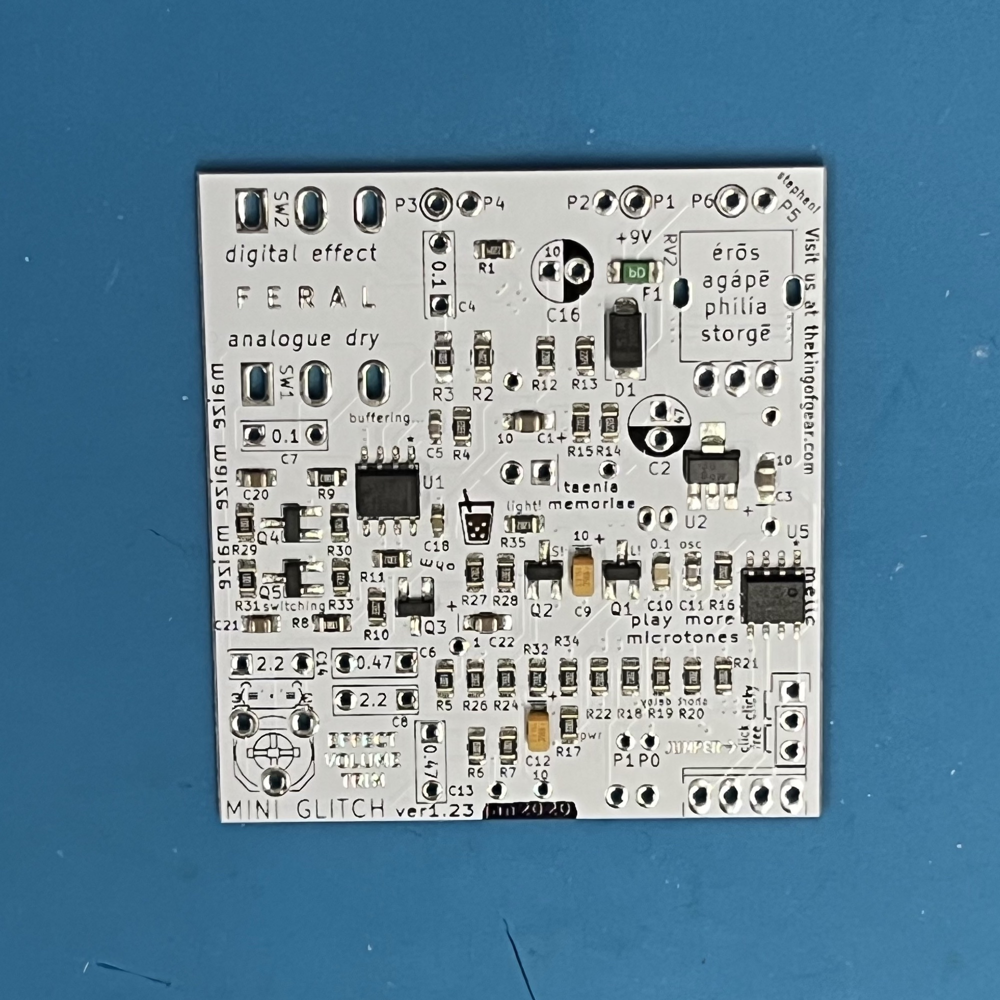
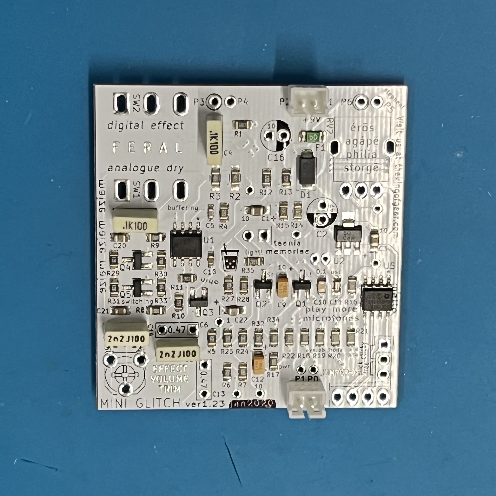
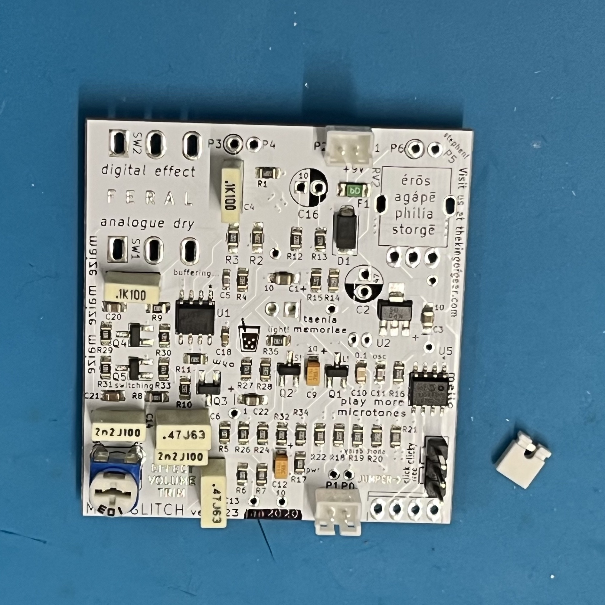

# Intro
###
### most of the components on the PCB are small "surface mount" components. they have no leads (wires), and are soldered on the same side they are placed. these can be hand-soldered, but on this board they're machine-populated and soldered by an oven.
###
### however, there's a handful of "through hole" components that must be soldered on the opposite side. these days, it's more expensive to machine-populate that kind of part, so you'll solder them by hand. "through hole" components also form a more robust connection to the PCB, so all user-adjustable parts (like the trimpot and jumper) must be "through hole" so they don't get ripped off the board accidentally.
###
### equivalents to these "through hole" components are available in "surface mount" versions, but they're more expensive in that format (sometimes much more expensive). so it's cheaper use the "through hole" version and to pay someone to solder them.
###
# Step by Step
### first, use a black sharpie to cross out the text "jan2020" at the bottom edge of the PCB.
### use a single stroke to create a clear black bar:

###
### JST 2.0mm 2-pin connector:

### (these are used to connect the DC power jack and the footswitch)
###
### film box cap: 0.1uF (100nF):

### ONLY on C7, bend leads down before soldering (this prevents them from touching the switch that will be soldered above them).
###
### 100nF populated:

###
### film box cap: 2.2nF (2200pF):

###
### film box cap: 0.47uF (470nF):

### the 0.47uF cap is slightly taller than other film box caps, so solder last.
###
### trimpot: 10k ohmomo (103):

### if this won't stay in place easily, you can solder it before the caps.
###
### pin header: 2.54mm 3-pin:

###
### add white jumper to the upper pins:

### this forms a connection between them. electrically the same as a switch but much cheaper.
###
### POLAR!!
### electrolytic cap: 47uF.
### black half of circle with round pad is for negative pin of cap.

###
### trim electrolytic leads.

###
### trimmed:

###
### add 3 wires:

### we order these wires pre-trimmed to save on assembly time.
### these are used to connect the jacks. only one jack needs a wire to ground, because their grounds are connected through the metal enclosure.
### done.
